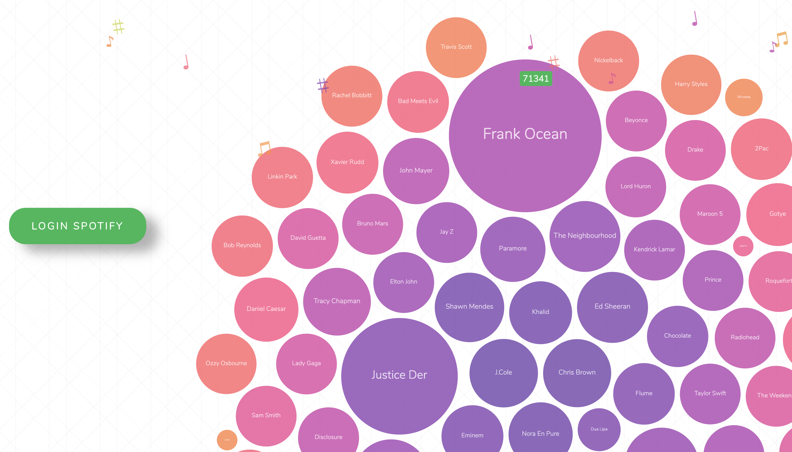
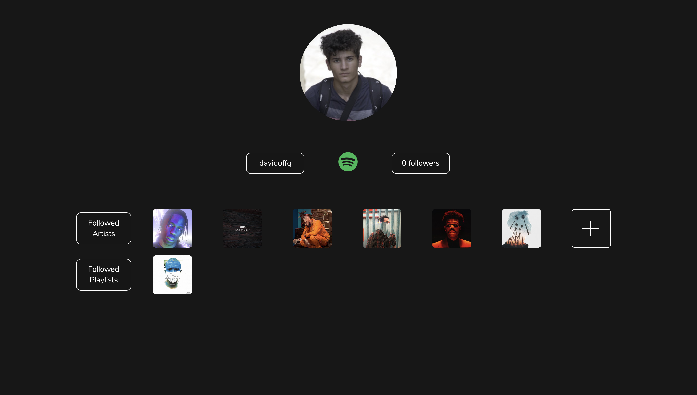
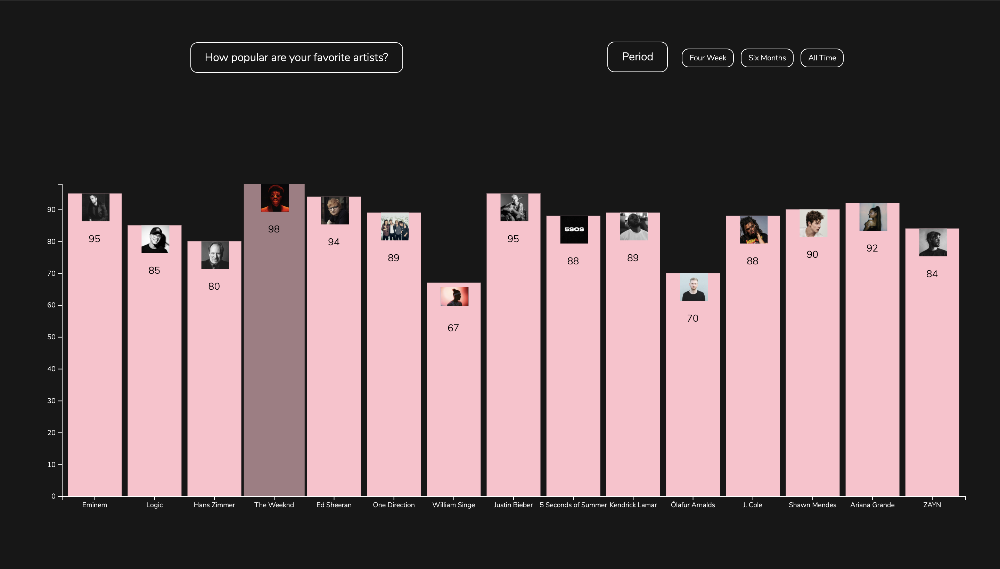
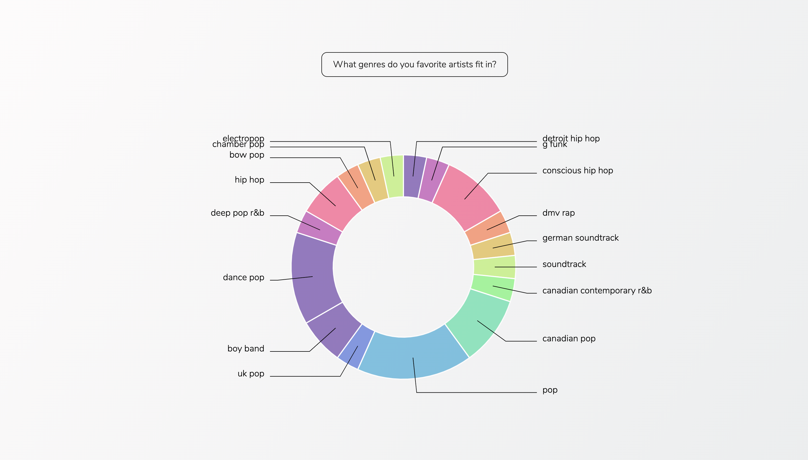
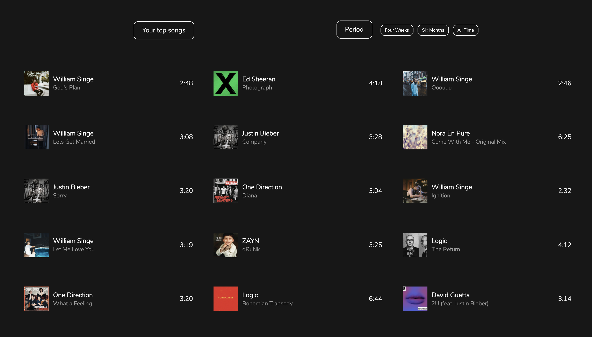
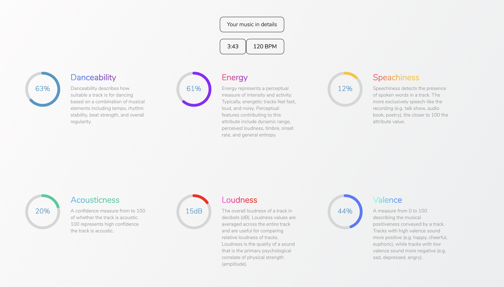
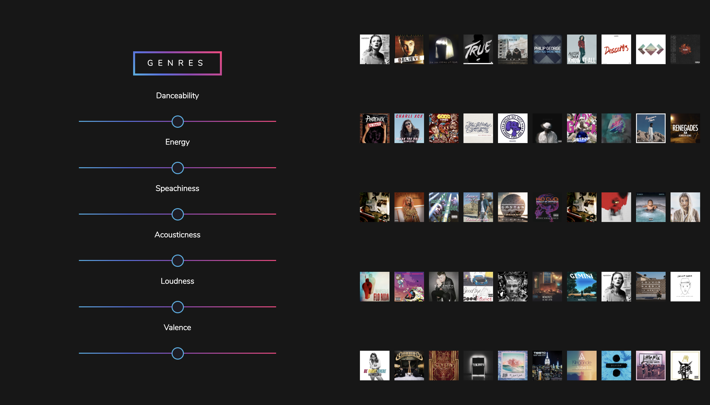

<!-- @format -->

# Harmony


[](https://standardjs.com)

#### Harmony is a web application that uses the Spotify API to retrieve data about music, user profiles, user favorite selections, a filter for future recommandations, a statistical approach at dissecting user's average favorite songs by different measures such as: danceability, acousticness, durability and so on.

#### The application uses two routes, first route is a login page that redirects the user to Spotify Authorization page where requests for permissions is asked and login credentials. The second route is the applcation itself.

Available routes:

- `/home`
- `/login - Spotify OAuth`

## Table of contents

- [Technologies](#technologies)
- [Setup](#setup)
- [Used packages and tools](#used-packages-and-tools)
- [Display](#display)

## Technologies

- JavaScript ES6(+)
- React.js
- Spotify API
- Express.js
- D3.js
- Styled Components
- OAuth

## Setup

```bash
  git clone https://github.com/octaviandd/harmony.git

  npm install

  cd server - node app.js
  cd client - npm start
```

## Used packages and tools

- Git
- VSCode
- terminal
- PhotoShop
- CSS Gradient

## Display

### Login Page



### Profile Slide



### Favorite Artists



### User's music genres graph



### User's favorite songs



### Average composition of user's songs



### Music filter and recommandations


